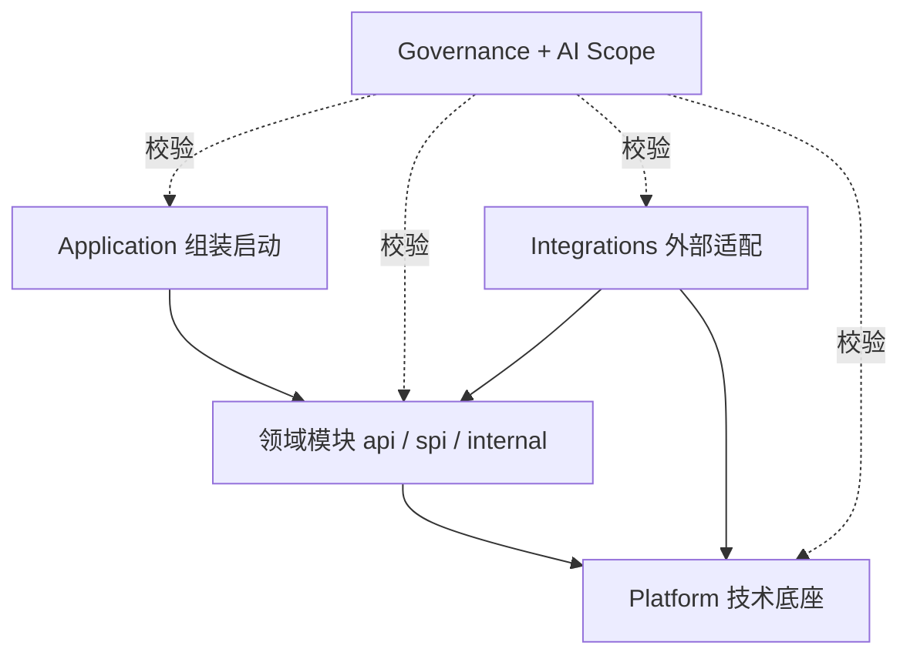
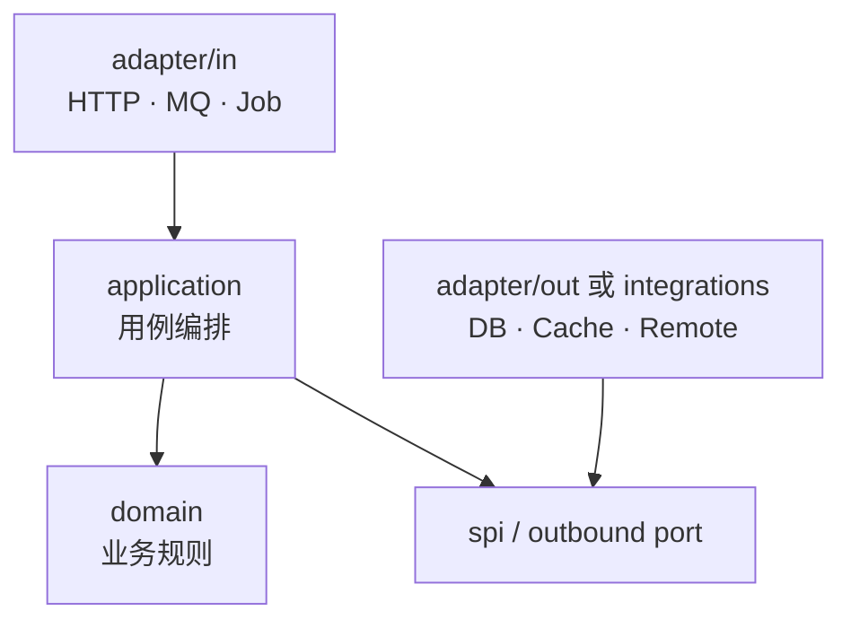

# AI 友好型 Spring Boot 开发规范

## 1. 目标与适用范围

### 1.1 目标

本规范用于解决 AI 参与 Java / Spring Boot 开发后的四类核心问题：

1. **改动边界不清晰**：Agent 容易同时修改 Controller、Service、DAO、公共工具和配置，影响范围难以判断；
2. **任务难以并行隔离**：需求无法稳定映射到独立目录，多个研发或 Agent 容易修改同一片代码；
3. **工程语义不足**：传统 `controller/service/dao/entity/utils` 只表达技术分层，不能直接表达业务职责；
4. **技术约束难以收口**：日志、异常、安全、数据库、缓存和消息等能力散落在业务代码中，仅靠文档难以约束。

最终目标是建立三层收口：

| 层次 | 载体 | 解决的问题 |
|---|---|---|
| 业务收口 | 领域模块 | 一项业务能力归属于明确模块 |
| 技术收口 | Platform | 基础技术能力统一配置和演进 |
| 架构收口 | Governance + AGENTS.md + Task Scope | 依赖方向、AI 行为和任务范围可验证 |

### 1.2 适用范围

适用于：

- 中大型 Spring Boot 后端项目；
- 模块化单体，以及未来可能拆分服务的系统；
- 研发与一个或多个编码 Agent 协作的项目；
- 希望逐步治理存量工程，而不是一次性重写的团队。

本规范默认以 **Java 17+、Spring Boot 3.x、Maven** 为示例。具体版本应由项目 BOM 统一管理。

### 1.3 非目标

本规范不要求：

- 所有业务都建立复杂聚合、工厂和值对象；
- 每个领域模块都拆成独立 Maven 工程；
- 为简单 CRUD 强行套用完整重型 DDD；
- 用目录和文档代替测试、评审与业务验收。

## 2. 总体架构

推荐技术组合：

| 能力 | 推荐方案 | 责任 |
|---|---|---|
| 应用框架 | Spring Boot | 应用运行和依赖装配 |
| 业务模块化 | Spring Modulith | 识别、验证和测试应用模块 |
| 代码访问边界 | `api / spi / internal` | 区分模块调用方、适配器和内部实现 |
| 架构强校验 | ArchUnit | 阻止非法依赖和越层调用 |
| AI 指令 | `AGENTS.md` | 声明仓库级、目录级开发规则 |
| 任务隔离 | `.ai/tasks/*.yaml` | 限定单次任务允许改动的文件和依赖 |
| 质量门禁 | Maven Enforcer、Checkstyle、SpotBugs、测试 | 在 CI 中阻断违规提交 |

整体关系如下：



## 3. 推荐工程目录

### 3.1 默认方案：包级模块化单体

新项目默认使用一个可运行的 Spring Boot 工程，以 Java package 作为业务模块边界。这样能够获得清晰边界，同时避免过早制造大量 Maven 子模块。

```text
project/
├── pom.xml
├── README.md
├── AGENTS.md                         # 仓库级 AI 规则
├── docs/
│   ├── architecture/
│   ├── domain/
│   └── adr/
├── .ai/
│   └── tasks/                        # 单次任务范围定义
│
├── src/main/java/com/company/product/
│   ├── ProductApplication.java
│   │
│   ├── order/                        # 订单领域模块
│   │   ├── AGENTS.md                 # 订单模块局部规则
│   │   ├── api/                      # 供其他业务模块调用
│   │   ├── spi/                      # 供适配器实现
│   │   └── internal/                 # 订单内部实现
│   │       ├── application/
│   │       ├── domain/
│   │       ├── adapter/
│   │       │   ├── in/
│   │       │   └── out/
│   │       └── config/
│   │
│   ├── customer/
│   │   ├── AGENTS.md
│   │   ├── api/
│   │   ├── spi/
│   │   └── internal/
│   │
│   ├── inventory/
│   ├── integrations/                 # SAP、CRM、短信等外部系统适配
│   └── platform/                     # 技术能力统一收口
│
└── src/test/java/com/company/product/
    ├── architecture/                 # Modulith / ArchUnit 规则
    └── modules/                      # 模块测试与集成测试
```

### 3.2 何时升级为 Maven 多模块

只有出现以下一种或多种情况时，再把 package 边界提升为 Maven module 边界：

- 不同模块由相对独立的团队长期维护；
- 构建速度要求独立编译；
- 模块需要独立发布或被多个应用复用；
- 仅靠包与 ArchUnit 已无法有效阻止违规依赖；
- Platform starter 需要提供给多个项目使用。

升级后的参考结构：

```text
project/
├── apps/
│   └── main-app/
├── modules/
│   ├── order-contract/
│   ├── order-service/
│   ├── customer-contract/
│   └── customer-service/
├── integrations/
│   ├── sap-adapter/
│   └── crm-adapter/
├── platform/
│   ├── platform-bom/
│   ├── platform-core/
│   ├── platform-web-starter/
│   └── platform-data-starter/
└── governance/
```

无论使用包级还是 Maven 级模块，依赖原则保持一致。

## 4. 业务模块规范

### 4.1 模块边界

一个模块代表一项稳定的业务能力，例如订单、客户、库存、支付。模块应明确写出：

- **负责什么**；
- **不负责什么**；
- **公开哪些能力**；
- **依赖哪些外部能力**；
- **拥有或主要维护哪些数据**。

这些信息写入模块目录下的 `AGENTS.md`，供研发和 Agent 在修改前读取。

### 4.2 `api / spi / internal` 的职责

```text
order/
├── api/                              # 调用方使用
│   ├── command/
│   ├── query/
│   ├── dto/
│   ├── event/
│   └── OrderFacade.java
├── spi/                              # 基础设施或外部适配器实现
│   ├── OrderRepository.java
│   └── OrderExportPort.java
└── internal/                         # 仅订单模块内部使用
    ├── application/
    │   ├── command/
    │   ├── query/
    │   └── assembler/
    ├── domain/
    │   ├── model/
    │   ├── service/
    │   ├── policy/
    │   └── event/
    ├── adapter/
    │   ├── in/
    │   │   ├── web/
    │   │   ├── mq/
    │   │   └── job/
    │   └── out/
    │       ├── persistence/
    │       ├── cache/
    │       └── mq/
    └── config/
```

规则如下：

- `api` 是其他业务模块唯一允许调用的入口；
- `api` 不得暴露 JPA Entity、Mapper、Repository 实现或内部领域对象；
- `spi` 用于声明由数据库、缓存、消息或外部系统适配器实现的端口；
- 其他业务模块不得把 `spi` 当作业务 API 调用；
- `internal` 中的类型不对模块外提供稳定性承诺；
- 模块外部禁止直接引用其他模块的 `internal`；
- 模块 API 变更属于显式契约变更，需要检查所有调用方。

若项目暂不需要独立外部适配层，可以先只使用 `api/internal`，将端口放在 `internal/application/port/out`；但一旦适配器需要跨模块独立演进，建议提升为明确的 `spi`。

### 4.3 让 Spring Modulith 真正识别公开接口

Spring Modulith 默认只把模块根包中的公开类型视为模块 API，模块的子包默认属于内部实现。因此，采用独立 `api`、`spi` 子包时，必须使用 Named Interface 显式声明，不能只依赖目录名称。

例如 `order.api/package-info.java`：

```java
@org.springframework.modulith.NamedInterface("api")
package com.company.product.order.api;
```

`order.spi/package-info.java`：

```java
@org.springframework.modulith.NamedInterface("spi")
package com.company.product.order.spi;
```

如果 `api` 下继续划分 `command`、`query`、`dto` 等 Java 子包，应为需要公开的子包声明同名 Named Interface，或统一配置递归的 Named Interface 检测策略。不得为了省事把整个模块配置为 Open Module。

模块还可以通过根包中的 `package-info.java` 声明依赖白名单：

```java
@org.springframework.modulith.ApplicationModule(
    allowedDependencies = {
        "customer :: api",
        "inventory :: api",
        "platform"
    }
)
package com.company.product.order;
```

这使“只能依赖其他模块公开 API”进入 Spring Modulith 的结构校验，而不只是文字约定。

### 4.4 模块内部调用方向



核心原则：

> 业务规则向内聚合，技术细节向外隔离。

### 4.5 分层职责

| 层 | 负责 | 不负责 |
|---|---|---|
| `adapter/in` | 协议解析、参数校验、身份上下文、Command/Query 转换 | 业务决策、直接访问 Repository |
| `application` | 用例编排、事务边界、权限用例、调用领域能力和端口 | 复杂领域规则、技术 SDK 细节 |
| `domain` | 实体、值对象、领域服务、策略、不变量 | HTTP、Spring MVC、数据库、Redis、MQ |
| `spi` | 定义业务所需的外部能力 | 具体技术实现 |
| `adapter/out` / `integrations` | 持久化、远程调用、缓存、消息等端口实现 | 改写领域规则 |
| `config` | 模块装配和框架配置 | 通用平台能力、业务流程 |

### 4.6 跨模块调用

禁止：

```java
import com.company.product.order.internal.domain.Order;
import com.company.product.order.internal.adapter.out.persistence.OrderMapper;
```

允许：

```java
import com.company.product.order.api.OrderQueryFacade;
import com.company.product.order.api.dto.OrderSummary;
```

依赖关系应始终是：

```text
Customer internal -> Order api -> Order internal
```

而不是：

```text
Customer internal -> Order internal
```

### 4.7 数据归属与事务

- 每张业务表应有明确的主责模块；
- 一个模块不得直接修改另一个模块拥有的表；
- 跨模块写操作通过 API 或领域事件完成；
- 同步调用用于必须立即获得结果的业务协作；
- 事件用于降低耦合、允许最终一致性的业务协作；
- 跨模块报表可使用专门的查询投影或只读视图，不应反向污染领域写模型；
- 事务边界通常放在 Application 层，一个用例对应一个清晰事务。

## 5. 对象和命名规范

### 5.1 对象转换链路

命名必须表达对象处于哪一层，避免全系统充斥含义不明的 `DTO/VO/BO/PO`。

写入链路：

```text
CreateOrderRequest
  -> CreateOrderCommand
  -> Order（Domain Model）
  -> OrderEntity（Persistence Model）
```

查询链路：

```text
OrderDetailQuery
  -> OrderDetailResult
  -> OrderDetailResponse
```

模块公开数据使用语义明确的 `Summary`、`Detail`、`Result` 或 `DTO`，同一项目内保持一致即可。

### 5.2 用例和服务命名

| 场景 | 推荐命名 | 避免 |
|---|---|---|
| 写用例 | `CreateOrderHandler`、`CancelOrderHandler` | `OrderServiceImpl` |
| 查询用例 | `GetOrderDetailHandler` | 含义模糊的 `query()` |
| 领域规则 | `OrderCancelPolicy`、`OrderPricingService` | 万能 `OrderManager` |
| 持久化端口 | `OrderRepository` | `OrderDaoHelper` |
| 技术实现 | `JpaOrderRepository`、`SapOrderAdapter` | `CommonService` |

原则上禁止新增无明确业务语义的顶层 `common`、`utils`、`manager` 包。确有复用价值时，应先判断能力属于：

- 某个业务模块；
- Platform 的一项明确技术能力；
- 独立且有边界的共享内核。

## 6. Platform 技术底座

### 6.1 职责

Platform 用于统一基础技术，而不是承载跨业务的“万能公共代码”。建议按能力拆分：

| 模块 | 收口内容 |
|---|---|
| `platform-bom` | JDK、Spring、数据库驱动、中间件和测试依赖版本 |
| `platform-core` | 最小异常基类、分页契约、时钟、ID、用户/租户上下文接口 |
| `platform-web` | Jackson、参数校验、统一错误响应、Filter、Interceptor、Trace |
| `platform-data` | 数据源、事务约定、分页、审计、SQL 日志 |
| `platform-security` | 认证、授权、接口安全、用户上下文实现 |
| `platform-cache` | Redis 配置、序列化、Key 规范、缓存观测 |
| `platform-mq` | 消息格式、序列化、重试、死信、幂等、Trace |
| `platform-observability` | 日志、Metrics、Tracing、健康检查 |
| `platform-test` | 测试基类、Fixture、容器化测试支持 |

### 6.2 Platform 约束

- Platform 不得依赖任何业务模块；
- Platform 不得包含订单、客户等业务语义；
- 业务模块优先使用 Platform 已提供的能力，不得私自重复配置；
- 修改 Platform 会影响多个模块，Task Scope 中必须显式声明原因和验证范围；
- 新增三方依赖必须经过依赖收口和安全检查；
- 不提供可任意取得 Spring Bean 的 `SpringContextUtil` 一类逃生通道。

## 7. Integrations 外部适配

SAP、CRM、MES、短信、钉钉、OSS 和第三方 AI 等外部系统必须通过适配层接入。

业务模块声明端口：

```java
public interface OrderExportPort {
    ExportReceipt export(OrderExportCommand command);
}
```

外部适配器实现端口：

```java
@Component
final class SapOrderAdapter implements OrderExportPort {
    // 协议转换、认证、重试和 SAP 客户端调用
}
```

约束：

- 业务模块不得直接依赖第三方 SDK；
- 外部返回模型不得穿透到领域层；
- 适配器负责协议转换、错误映射和可观测性；
- 重试、超时、熔断和幂等策略必须显式配置；
- 外部系统替换时，业务用例和领域规则原则上无需改动。

## 8. AI 开发约束

### 8.1 两级 `AGENTS.md`

仓库根目录的 `AGENTS.md` 声明全局规则，模块目录下的 `AGENTS.md` 声明局部职责和限制。

Agent 开始任务前应依次读取：

1. 仓库根目录 `AGENTS.md`；
2. 任务涉及目录中距离文件最近的 `AGENTS.md`；
3. 对应 Task Scope；
4. 相关架构说明、ADR 和模块 API。

局部规则只能在自己的目录范围内补充或收紧全局规则，不得静默放宽全局约束。

### 8.2 Task Scope

每项 AI 开发任务建议建立 `.ai/tasks/<task-id>.yaml`，至少包含：

- 任务目标；
- `allowed`：允许修改目录；
- `readonly`：可以阅读但不得修改；
- `forbidden`：不得访问或不得修改的目录；
- 允许新增的模块依赖；
- 必须执行的验证；
- 验收条件；
- 超出范围时的处理方式。

示例见 [`templates/task-scope.yaml`](../templates/task-scope.yaml)。

### 8.3 Agent 执行流程


执行要求：

- 默认采用最小改动，不顺手重构任务无关代码；
- 需要修改 Scope 外文件时必须暂停并说明原因，不能自行扩大范围；
- 新增跨模块调用前先确认目标模块是否已有公开 API；
- 修改公开 API 时必须列出调用方和兼容性影响；
- 修改 Platform 或全局配置时必须提高验证等级；
- 不得用复制代码规避正确的模块契约；
- 任务完成后报告改动文件、测试结果、未决风险和后续动作。

### 8.4 多 Agent 任务拆分

优先按模块和契约拆分，而不是按 Controller、Service、DAO 技术层拆分。

例如“取消订单后恢复库存并通知 SAP”可拆为：

| 子任务 | 写入范围 | 交付物 |
|---|---|---|
| 订单规则 | `order/**` | 取消规则、公开事件或 API |
| 库存恢复 | `inventory/**` | 库存恢复能力 |
| SAP 通知 | `integrations/sap/**` | 端口实现、错误映射 |
| 集成验证 | `src/test/**` | Contract、集成和架构测试 |

并行规则：

- 一个目录在同一时段原则上只有一个写入责任方；
- 多个任务依赖同一契约时，先确定契约再并行实现；
- 共享文件、Platform 和数据库迁移需要单独分配责任方；
- 主任务负责最终依赖检查、集成测试和冲突消解；
- 目录边界是任务调度的重要依据，但不能代替业务依赖分析。

## 9. Governance：把规则变成门禁

只写文档不足以约束研发和 Agent。关键规则必须由自动化测试和 CI 执行。

### 9.1 Spring Modulith

至少验证模块依赖、循环依赖和内部包访问：

```java
class ModularityTests {

    @Test
    void verifiesModuleStructure() {
        ApplicationModules.of(ProductApplication.class).verify();
    }
}
```

模块级集成测试可使用 `@ApplicationModuleTest`，确保单个业务模块能在受控依赖下运行。

### 9.2 ArchUnit

建议强制以下规则：

1. 模块外不得依赖其他模块的 `internal`；
2. Domain 不得依赖 Spring MVC、JPA、Redis、MQ 或 HTTP Client；
3. Controller 不得直接访问 Repository；
4. Platform 不得依赖业务模块；
5. 禁止循环依赖；
6. 禁止新增无语义的 `common`、`utils` 顶层包。

示例：

```java
@AnalyzeClasses(packages = "com.company.product")
class ArchitectureTests {

    @ArchTest
    static final ArchRule moduleInternalsArePrivate = noClasses()
        .that().resideOutsideOfPackage("..order..")
        .should().dependOnClassesThat()
        .resideInAPackage("..order.internal..");

    @ArchTest
    static final ArchRule domainIsFrameworkIndependent = noClasses()
        .that().resideInAPackage("..internal.domain..")
        .should().dependOnClassesThat()
        .resideInAnyPackage(
            "org.springframework..",
            "jakarta.persistence..",
            "org.apache.kafka..",
            "org.springframework.data.redis.."
        );
}
```

实际项目应按包名和允许的例外细化规则，例外必须有注释、负责人和清理计划。

### 9.3 CI 最低门禁

每次合并至少执行：

```text
编译
-> 单元测试
-> 模块测试 / 集成测试
-> Spring Modulith verify
-> ArchUnit
-> Checkstyle / SpotBugs
-> Maven Enforcer
-> Task Scope 越界检查
```

其中 Task Scope 越界检查可使用 `git diff --name-only` 与任务 YAML 的路径规则比对。违规时 CI 应失败，而不是只输出警告。

## 10. 测试策略

测试应与架构边界一致：

| 测试类型 | 目标 | 推荐范围 |
|---|---|---|
| Domain 单元测试 | 验证业务规则和不变量 | 不启动 Spring |
| Application 测试 | 验证用例编排和端口交互 | 使用 Fake / Mock 端口 |
| Module 测试 | 验证单模块装配与持久化 | `@ApplicationModuleTest` |
| Contract 测试 | 验证 API、消息和外部协议兼容性 | 提供方与消费方 |
| Integration 测试 | 验证数据库、MQ、外部适配 | Testcontainers 或等价方案 |
| Architecture 测试 | 验证依赖和分层规则 | Spring Modulith + ArchUnit |

AI 生成代码时，不只要求“新增测试”，还必须根据变更点明确测试层级和风险覆盖。

## 11. 文档规范

### 11.1 必备文档

| 文档 | 内容 |
|---|---|
| `README.md` | 项目目标、启动方式、文档导航 |
| 根 `AGENTS.md` | 全局 AI 与研发约束 |
| 模块 `AGENTS.md` | 模块职责、入口、契约、依赖和数据归属 |
| `docs/architecture` | 总体架构、模块图、依赖原则 |
| `docs/adr` | 重要架构决策及原因 |
| `.ai/tasks` | 当前或历史 AI 任务范围 |

### 11.2 文档随代码更新

出现以下变更时必须同步文档：

- 新增、拆分、合并业务模块；
- 修改模块公开 API 或事件；
- 新增跨模块依赖；
- 修改 Platform 基础能力；
- 新增外部系统；
- 引入架构规则例外。

## 12. 渐进式落地路线

### 阶段一：先建立可读边界

- 识别 3～7 个核心业务模块；
- 将代码从纯技术分层调整为业务模块优先；
- 建立 `api/internal`；
- 增加根目录与模块级 `AGENTS.md`。

### 阶段二：建立自动约束

- 接入 Spring Modulith；
- 为最重要的依赖规则编写 ArchUnit；
- 在 CI 中阻断循环依赖和跨模块 internal 访问；
- 禁止继续增加新的 `common/utils` 债务。

### 阶段三：收口基础技术

- 盘点日志、异常、认证、数据库、缓存和 MQ 配置；
- 按能力迁入 Platform；
- 通过 BOM 和 starter 统一版本与默认行为；
- 为 Platform 变更建立更高等级回归要求。

### 阶段四：AI 任务工程化

- 引入 Task Scope 模板；
- 自动检查变更文件是否越界；
- 按业务模块分配多 Agent 任务；
- 生成变更报告、影响范围和回归建议。

存量项目不建议一次性重构。优先保证“新需求不再制造新的无边界代码”，再按业务改动逐步迁移旧代码。

## 13. 架构决策摘要

| 决策 | 选择 | 原因 |
|---|---|---|
| 代码组织优先级 | 业务模块优先 | 需求和 Agent 任务通常按业务能力发生 |
| 默认部署形态 | 模块化单体 | 保留清晰边界，降低分布式复杂度 |
| 模块公开方式 | `api` | 调用关系稳定、显式、可检索 |
| 外部实现方式 | `spi` + adapter | 业务不依赖具体技术和供应商 |
| 技术能力 | Platform | 避免每个模块重复建设和配置漂移 |
| AI 约束 | `AGENTS.md` + Task Scope | 同时提供长期规则和单次任务边界 |
| 规则执行 | Modulith + ArchUnit + CI | 将建议升级为可失败的工程门禁 |

## 14. 参考项目与规范

- [Spring Modulith Reference：Fundamentals](https://docs.spring.io/spring-modulith/reference/fundamentals.html)
- [Spring Modulith Reference：Module Testing](https://docs.spring.io/spring-modulith/reference/testing.html)
- [Spring Modulith](https://github.com/spring-projects/spring-modulith)
- [Spring PetClinic Modulith](https://github.com/spring-petclinic/spring-petclinic-modulith)
- [ArchUnit](https://github.com/TNG/ArchUnit)
- [components-example](https://github.com/thombergs/components-example)
- [DDD by Examples / Library](https://github.com/ddd-by-examples/library)
- [AGENTS.md](https://agents.md/)

这些项目分别提供模块化、依赖校验、领域建模和 Agent 指令方面的成熟实践。本规范在其基础上增加了 Platform 技术收口、Task Scope 和多 Agent 隔离规则。
